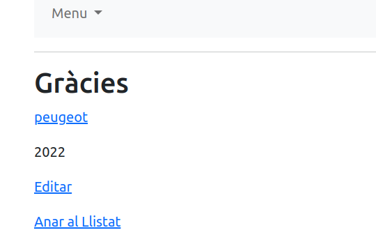
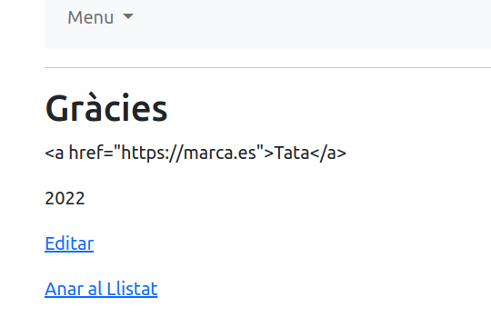

# Exemples bàsics de seguretat

En aquest exercici veurem alguns exemples del que pot passar quan el codi no segueix un mínim de bones pràctiques, ja sigui per desconeixement o per les presses.

La seguretat total no existeix, però està en la nostra mà fer les coses de manera que el risc sigui el menor possible.

---

## Injecció de codi sql

Aquest és un dels atacs més bàsics. Es produeix quan l'atacan pot modificar la sentència sql que volem executar, afegint nou codi i fent que s'exposin dades que no haurien de sortir.

El cas més comú es produeix quan no se fan servir les eines de la llibreria d'accés a la base de dades i la sentència sql es monta concatenant cadenes de texte, una de les quals ve recollida des de la web.

A l'editor de marques tenim:

```php
$id = $_GET['id'];
  $statement = $pdo->prepare("SELECT * FROM marques where uuid=?");
  $statement->bindParam(1, $id);
  if ($statement->execute()) {

  foreach ($statement->fetchAll() as $row) {
     $nom = $row['nom'];
     $uuid = $row['uuid'];
     $anyo = $row['anyo'];
  }
}
```

Aquí agafam l'identificador des de la web i com podem veure es fa un `prepare` i  un `bindParam` per proporcionar el valor del paràmetre a l'sql. Això fa que el paràmetre s'escapi i eviti la majoria d'atacs.

```php
if (isset($_GET['id'])) {
        $id = $_GET['id'];
        $statement = "SELECT * FROM marques where uuid='$id'";
        
        echo "<!--\n";
        echo "sql = $statement\n";
        foreach ($pdo->query($statement) as $row) {
            $nom = $row['nom'];
            $uuid = $row['uuid'];
            $anyo = $row['anyo'];
            
            echo "$nom, $uuid; $anyo \n";
            
        }
        echo "-->\n";
    }
```

Si no utilitzam el `pepare` i fem servir el `query` directamen passant el paràmetre, podem veure que tot funciona exactament igual, no hi ha problema pareix.

He afegit uns quants `echos` per poder veure millor què passa.

Ara podem fer un atac d'injecció de codi, per veure dades que d'altra manera potser no hauríem de veure.
A la url original `http://localhost/2023/seguretat/edit.php?id=63878a1e2b950` en el meu cas, la modificam suposant que el programador no ha escapat el codi. Afegim:

```sql
' or '1'='1
```

és a dir, tamcam la cometa i afegim una nova instrucció, com que és un `or` ens tornarà tots els registres que compleixin una de les dues condicions, i fem que l'`or` sempre sigui vertader construïnt `'1'='1'`. Fixem-nos que no hem posat la segona cometa, ja que es la que ens quedaria de la instrucció original.

La url ens queda `http://localhost/2023/seguretat/edit.php?id=63878a1e2b950%27%20or%20%271%27=%271` una vegada el navegador a canviat els espais per la seva codificació. Si l'executam podem veure que el programa funciona, però que no ens està mostrant el registre demanat, sino un altre.

Si anam el codi font podem veure que tenim els codis de tots els registres. En el meu cas:

```html
<!--
sql = SELECT * FROM marques where uuid='63878a1e2b950' or '1'='1'
 peugeot 3   , 63878a1e2b950; 2024 
 HOLA caracola, 638790b107fee; 2023 
 ASDFADS, 638790fe0c820; 2023 
 test  , 6387a964c7247; 33 
-->
```

En el nostre exemple totes les dades són públiques, però imagiem per un moment que es filtre segons l'usuari, aquest atac ens permetria veure dades a les que normalment no hi tendríem accés.

Però posats a fer coses, també podem fer mal, esborrant els registres que tenguem a la base de dades, fent servir una tècnica semblant. Una vegada es pot injectar codi sql, les possiblitats són immennes.
Per exemple podem esborrar la base de dades

```sql
';delete from marques where '1'='
```

En aquest cas, aprofitam que l'sql ens permet executar més d'una comanda a l'hora separant-les per punt i coma  `;`. Hem aplicat la mateixa tècnica pere fer que la base de dades ara esborri.

## xss

De la mateixa manera que hem d'anar molt alerta amb les consultes, també ho hem de fer amb les dades que posam a la base de dades i que després retornam a la web.

El nostre codi original per `save.php` 

```php
if (empty($uuid)) {
        $uuid= uniqid();
        $stm = $pdo->prepare("INSERT INTO marques(nom, anyo, uuid) VALUES (?, ?, ?)");
      } else {
        $stm = $pdo->prepare("UPDATE marques SET nom=?, anyo=? WHERE uuid=?");
      }
      /* no s'ha de fer mai això */
      //  To redirect form on a particular page
      $stm->bindParam(1, $nom);
      $stm->bindParam(2, $anyo);
      $stm->bindParam(3, $uuid);
...
```

no és sensible a un atac sql, però un atacant pot intentar injectar-nos codi html o javascript. Per exemple, en el nom del cotxe posarem:

```html
<a href="https://google.com">peugeot</a>
```

Com que no es fa cap tractament de la informació aquesta informació es guarda a la base de dades i després el sistema la torna mostrar



el link es clickable i ens duu a google, però ens podria dur a qualsevol altre lloc, o executar javascript. Per evitar això hem de tractar sempre el codi que posam a la base de dades per evitar que ens puguin afegir codi html directament. Si afegim

```php
      /* escapam l'html */
      $nom = htmlentities($nom, ENT_QUOTES);
      $anyo = (int) $anyo;
      $uuid = htmlentities($uuid, ENT_QUOTES);
      /* ---------------- */
```

abans de guardar les dades a la base de dades, tendrem un nivell de protecció millor.



## Conclusions

Hem vist alguns dels atacs més comuns i maneres de minimitzarlos. El seguretat en el codi és un tema molt complex i hem d'estar molt atents a les millors pràctiques de programació i pensar sempre que tota la informació que ve des de fora és un risc potencial.

Les llibreies i frameworks de programació a més d'accelerar-nos el desenvolupament, ja tenen aquestes pràctiques interioritzades i podem fer que el nostre codi sigui més segur per defecte.

Però clar, els la nostra responsabilitat fer-los servir.